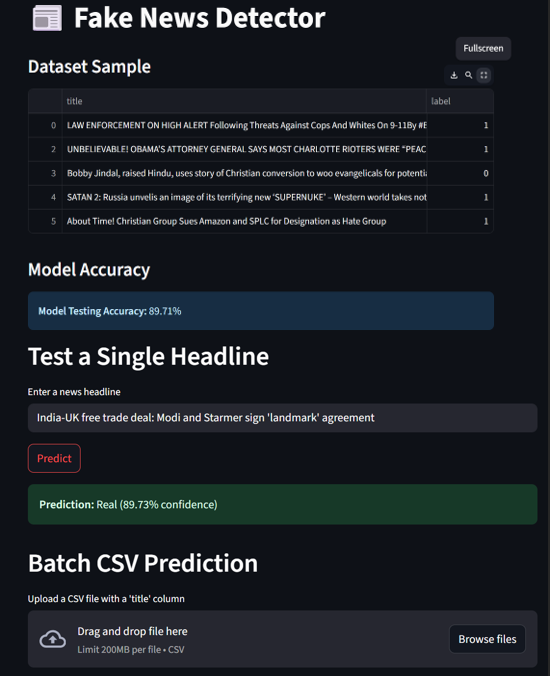

# 📰 Fake News Detector

A machine learning-based web application to detect whether a news headline is **real** or **fake**.

## 🚀 Objective

To classify news headlines as *real* or *fake* using Machine Learning techniques.

## 🛠️ Tools & Technologies Used

- **Python**
- **pandas** – Data manipulation and analysis  
- **scikit-learn** – Model building and evaluation  
- **TfidfVectorizer** – Feature extraction from text  
- **Logistic Regression / SVM** – Classifiers  
- **Streamlit** – Web interface for the app
- **joblib** - save model

## 🧭 Project Steps

1. **Load and Clean Dataset**
   - Merged real and fake news datasets.
   - Preprocessed text (e.g., lowercasing, removing punctuation).

2. **Text Vectorization**
   - Used `TfidfVectorizer` to convert text into numerical format.

3. **Model Training**
   - Trained a Logistic Regression  on the processed data.

4. **Web App Interface**
   - Built with **Streamlit** to allow:
     - Disply top 5 records of dataset
     - Inputting a custom headline for prediction.
     - Displaying prediction label and confidence score.
     - Uploading a CSV file for batch detection.

## 📦 Deliverables

- ✅ `Streamlit` web app (`app.py`)
- ✅ Trained model file (`model.pkl`, `vectorizer.pkl`)
- ✅ Evaluation metrics (accuracy, confusion matrix, etc.)
- ✅ Example test results
- ✅ `requirements.txt` for dependencies

## 📷 UI Preview

 

## 📁 File Structure
├── app.py
├── assets/
│ └── fake_news_ui.png
├── model/
│ ├── model.pkl
│ └── vectorizer.pkl
├── data/
│ └── news.csv
├── test_results/
│ └── sample_output.csv
├── requirements.txt
├── README.md
└── .gitignore

